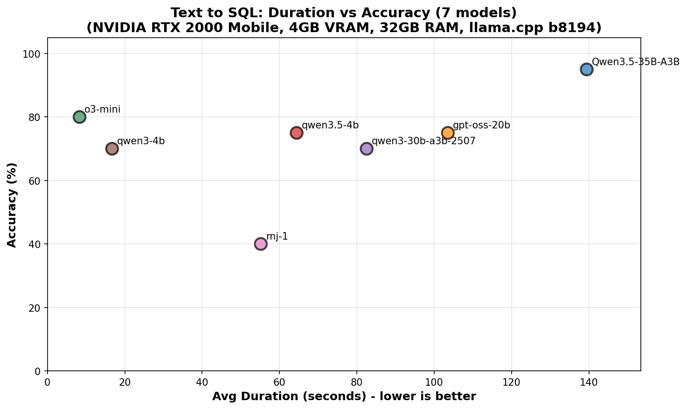

# Semantic SQL Testing

A benchmark for Small Language Models (SLMs) on SQL generation tasks. It uses a well-defined semantic model with verified SQL queries and sample values to evaluate how accurately local LLMs can generate SQL from natural language questions.

## Results



## How It Works

1. **Semantic Model** — A detailed schema definition (`semantic_model.txt`) describing a TPC-DS star schema (store_sales, store_returns, date_dim, store, customer, item) with measures, dimensions, anti-patterns, and verified example queries
2. **20 Test Questions** — Ranging from simple aggregations to complex multi-year comparisons with return rates (`questions.json`)
3. **Local LLM Inference** — Models run locally via [llama.cpp](https://github.com/ggml-org/llama.cpp) server, quantized to Q4_K_M (4-bit)
4. **Automated Judging** — Claude Opus acts as an invisible judge, comparing model outputs against a verified baseline using column-value matching with numeric tolerance

## Hardware

- **GPU**: NVIDIA RTX 2000 Mobile (4GB VRAM)
- **RAM**: 32GB
- **Inference**: llama.cpp b8157

## Models Tested

| Model | Parameters | Type | Quantization |
|-------|-----------|------|-------------|
| Qwen3.5-35B-A3B | 35B (3B active) | MoE | Q4_K_M |
| Qwen3.5-4B | 4B | Dense (GDN+MoE) | Q4_K_M |
| Qwen3-4B | 4B | Dense | Q4_K_M |

The chart below is auto-generated by the notebook after each benchmark run.

## Running the Benchmark

### Prerequisites

- Python with `duckdb`, `pandas`, `matplotlib`, `requests`, `psutil`
- [llama.cpp](https://github.com/ggml-org/llama.cpp) server binary
- GGUF model files

### Usage

1. Configure model paths in `MODEL_CONFIGS` inside `SLM_SQL_test.ipynb`
2. Run the notebook — the `run_test()` function handles everything:
   - Starts llama-server with the selected model
   - Runs all 20 SQL questions with feedback loop
   - Validates results against the baseline
   - Plots speed vs accuracy chart
   - Stops the server

```python
run_test('Qwen3.5-35B-A3B')
```

## Project Structure

```
├── SLM_SQL_test.ipynb    # Main benchmark notebook
├── semantic_model.txt    # Semantic model definition (system prompt)
├── questions.json        # 20 test questions
├── log/                  # Test results (JSON logs per model run)
└── LICENSE               # MIT License
```

## Key Design Decisions

- **Never join fact tables directly** — Uses CTE pattern with FULL OUTER JOIN for combining sales and returns
- **Feedback loop** — Models get a chance to self-correct their SQL after seeing initial results
- **Column-value matching** — Judging ignores column names and matches by value similarity with numeric tolerance (0.5%), handling cases where models return extra columns
- **Invisible baseline** — The reference answers are excluded from charts, only evaluated models are shown

## License

MIT
